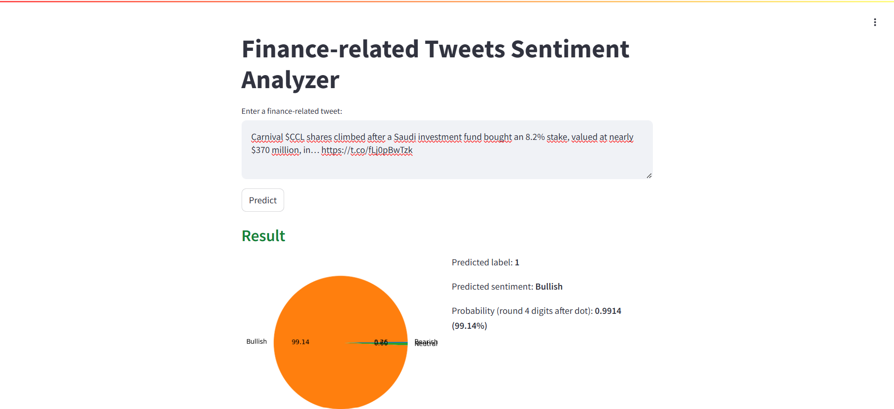

# Sentiment Analysis from Twitter Financial News Dataset and web app demonstration
This is a self-project, which is started from August 2024 to October 2024. In this project, I researched and trained RoBERTa model for analyzing sentiment from Twitter Financial News Dataset. Then, I built and demonstrated a web app for this task by using Streamlit. Besides, I utilized BERT model for doing the same task (sentiment analyst) and compared this model with RoBERTa.

## Dataset
[The Twitter Financial News Dataset](https://huggingface.co/datasets/zeroshot/twitter-financial-news-sentiment) is a collection of financial-related tweets that collected using the Twitter API and designed for multi-class classification tasks. It contains financial-related tweets labeled as either bearish, bullish and neutral.

## Employment
Because I implemented all of files in Kaggle, I do steps bellow:
- Firstly, I ran a notebook file (.ipynb). In this notebook, I implemented steps: 
	1. Read dataset
	2. Data exploration
	3. Data preprocessing (in particularly preprocessing tweets)
	4. Split data into train/dev/test sets
	5. Trained, evaluated and predicted RoBERTa model. Then, saved model for building web app.
	6. Trained, evaluated and predicted BERT model
	7. Compared RoBERTa model with BERT model

- Finally, I ran file app.py for demonstrating web app for tweets sentiment analysis.  
	With app.py, I ran in some steps:
	- Step 1: Ensured that I finished implementing step 5 in file ipynb và installed `streamlit` library and `localtunnel` for running app.
	- Step 2: Added cell and then If I was created a folder to locate file app.py in Kaggle (in particular went to Datasets to create), I would have gone to step 3, else types commands below:
		```
		%%writefile app.py
		# Copied and pasted all information in file app.py
		```
	- Step 3: Added cell, type command `!curl ipv4.icanhazip.com` and then I ran this cell for seeing tunnel password (like a IP address) to access for running web.
	- Step 4: Added cell, type command `!streamlit run app.py &>./logs.txt & npx localtunnel --port 8501` to run web app. At this time, web link was available, then I accessed this link, press tunnel password (available in step 3) and I could use web app now.
	P/s: From step 2 to step 4, I added cell after **Summary** code cell in notebook file. 

## Web app template



## References
1. [RoBERTa: A Robustly Optimized BERT Pretraining Approach](https://arxiv.org/pdf/1907.11692)
2. [BERT: Pre-training of Deep Bidirectional Transformers for Language Understanding](https://arxiv.org/pdf/1810.04805)
3. [Sentiment Analysis - Kaggle](https://www.kaggle.com/code/rouge57/sentiment-analysis)
